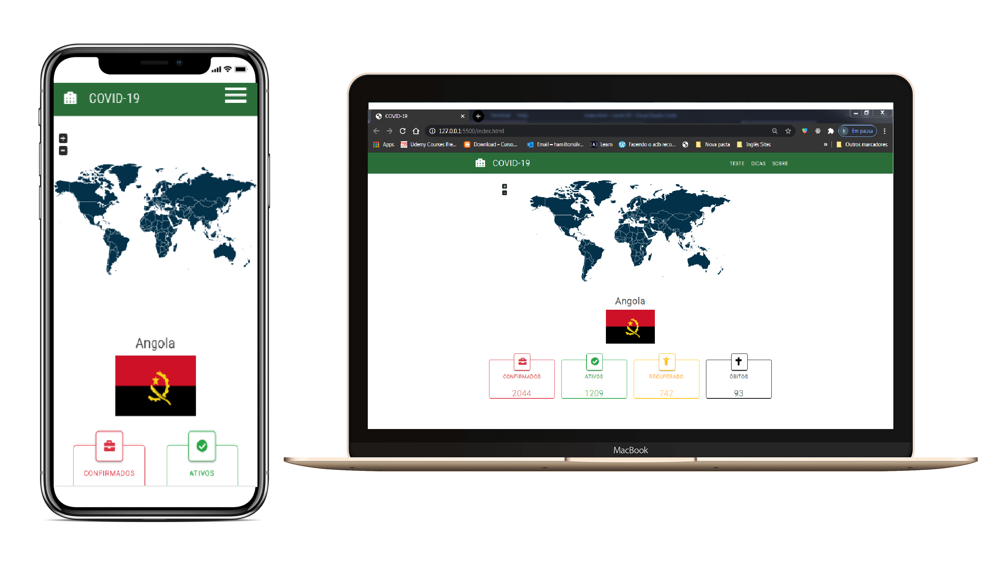

<h1 align="center">
    COVID - MAP
</h1>

<h4 align="center">
  ☕ Code and coffee
</h4>

  <a href="#uniplace-tecnologias">Tecnologias</a>&nbsp;&nbsp;&nbsp;|&nbsp;&nbsp;&nbsp;
  <a href="#-projeto">Projeto</a>&nbsp;&nbsp;&nbsp;|&nbsp;&nbsp;&nbsp;
  <a href="#-layout">Layout</a>&nbsp;&nbsp;&nbsp;|&nbsp;&nbsp;&nbsp;
  <a href="#-como-contribuir">Como contribuir</a>&nbsp;&nbsp;&nbsp;|&nbsp;&nbsp;&nbsp;
  <a href="#memo-licença">Licença</a>

 

 

  

## 🚀 Tecnologias

Esse projeto foi desenvolvido com as seguintes tecnologias:

- [JavaScript (ES6+)](https://developer.mozilla.org/pt-BR/docs/Web/JavaScript)
- [HTML](https://developer.mozilla.org/pt-BR/docs/Webt)
- [CSS](https://developer.mozilla.org/pt-BR/docs/Web)

## 💻 Projeto

O COVID-MAP é um projeto que visa conectar pessoas que querem se informa sobre o estado actual do covid no seu País.

## 🔖 Layout

Layout foi desenvolvido no decorrer do desenvolvimento do projecto !

## 🤔 Como contribuir

- Faça um fork desse repositório;
- Cria uma branch com a sua feature: `git checkout -b minha-feature`;
- Faça commit das suas alterações: `git commit -m 'feat: Minha nova feature'`;
- Faça push para a sua branch: `git push origin minha-feature`.
### OBS ; Precisa de ser trabalhado mais no Mobile 
Depois que o merge da sua pull request for feito, você pode deletar a sua branch.

## :memo: Licença

Esse projeto está sob a licença MIT. Veja o arquivo [LICENSE](LICENSE.md) para mais detalhes.

---

Feito com ♥ by Hamilton Silva :wave: [Entre na nossa comunidade!](https://www.facebook.com/groups/2330277530393634)

## Redes Socias 
- [Facebook](https://www.facebook.com/tiohs.u)
- [Linkdin](https://www.linkedin.com/in/hamilton-silva-502355195/)
